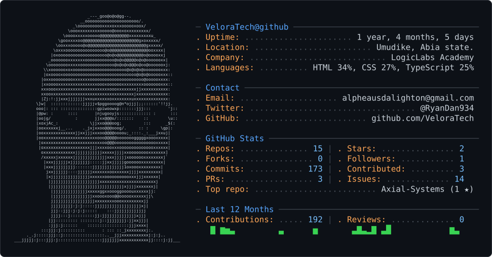

<picture>
  <source media="(prefers-color-scheme: dark)" srcset="dark_mode.svg" />
  <source media="(prefers-color-scheme: light)" srcset="light_mode.svg" />
  
</picture>

# 👋 Hey, I'm CoachLogic

### Software Developer · Computer Engineering Student · Builder

> **I build products. I explore systems. I learn by taking things apart.**

[](https://github.com/VeloraTech)
[](https://www.linkedin.com/in/alpheaus-daniel-804600366)
[](mailto:alpheausdalighton@gmail.com)

---

## `$ whoami`

I'm a **software developer, Computer Engineering student, and builder** interested in turning ideas into working products.

I started with the web — HTML, CSS and JavaScript — and gradually moved toward application development, backend systems, databases, APIs, and product architecture.

A lot of my curiosity starts with a simple question:

> **"How does this actually work underneath?"**

Sometimes the best way I find out is to build a smaller version myself.

---

## `$ now`

Currently building, learning, and experimenting with:

```text
01  CuraMed
    Healthcare platform · Python · FastAPI · PostgreSQL · React

02  Umudike Homes
    Housing & accommodation platform · React · Node.js · Express

03  MyVendor
    Hyper-local marketplace · products · services · local commerce

04  Developer Tooling
    Exploring automated code cleanup & developer workflows

05  React Native + Python
    Expanding beyond the web and deepening my backend knowledge
```

> **The goal: keep building while going deeper.**

---

# `$ selected_builds`

## 🩺 CuraMed

A healthcare-focused platform I'm building around clinical workflows, analysis and intelligent assistance.

**Focus:** backend architecture · APIs · databases · intelligent systems

**Stack:** Python · FastAPI · PostgreSQL · React

> **Status:** Active development

---

## 🏠 Umudike Homes

A housing and accommodation platform designed to make discovering and managing accommodation easier.

**Focus:** product development · web applications · authentication · databases

**Stack:** React · Node.js · Express.js · PostgreSQL

> **Status:** Active development

---

## 🛍️ MyVendor

A hyper-local marketplace concept connecting people with nearby vendors, products and service providers.

The idea is simple:

> **Make it easier to discover what — and who — is available around you.**

**Focus:** marketplace architecture · mobile/web applications · local commerce

> **Status:** Preparing to build

---

# `$ selected_web_work`

Software isn't limited to large applications.

I also enjoy building websites and digital experiences where **design, interaction and functionality** come together.

This section will grow as I build and publish more client and personal web projects.

### 🎥 Videographer Website

A visual-focused website concept for a videographer, built around presenting creative work through a polished digital experience.

> **Status:** Planned

### 👤 Portfolio Experiences

I'm also interested in building distinctive portfolio websites rather than relying on generic templates.

> **Status:** Ongoing exploration

---

# `$ engineering_lab`

Not every project starts as a product.

Some start as a question.

### 🧹 Developer Tooling

What started as a simple idea to automatically remove debugging traces such as `console.log()` statements from production code became a much bigger question:

> **What if developer cleanup and workflow automation could be handled systematically across projects and languages?**

I'm exploring the idea from a small JavaScript utility toward broader developer tooling and automation.

> **Status:** Experimental

---

### 🎨 Block AI

An early exploration around turning visual interface designs into usable code.

The bigger idea is to explore the relationship between:

```text
Design
   ↓
Structure
   ↓
Code
   ↓
Responsive Interface
```

The long-term question:

> **Can the design itself become the source of truth for the application?**

> **Status:** Experimental

---

### ⚙️ Nomos

An early SDK/platform concept exploring reusable backend infrastructure that developers could plug into their applications instead of repeatedly building the same foundations from scratch.

Areas explored include:

* validation
* security
* integrity
* AI services
* financial infrastructure
* reusable backend services

> **Status:** Experimental / On hold

---

# `$ things_i_want_to_understand`

My interests go beyond the technologies I currently use.

```text
systems
├── operating systems
├── programming languages
├── compilers & interpreters
├── networking
├── virtualization
├── hardware ↔ software
└── distributed systems

developer infrastructure
├── automation
├── developer tooling
├── SDK design
├── workflow systems
└── build pipelines

intelligent systems
├── AI agents
├── AI-assisted development
└── intelligent workflows

security & networking
├── application security
├── privacy systems
├── encryption
├── tunneling
└── network architecture
```

I don't claim to be an expert in these areas.

They're simply the things I'm curious enough to eventually **build my way into understanding**.

---

# `$ stack`

### Working with


### Currently learning


### Exploring


---

# `$ deployment`

I've worked with web deployment and hosting environments including:

* **Vercel**
* **Omnina**

As my projects grow, I'm getting deeper into deployment, infrastructure, containers, and production systems.

---

# `$ philosophy`

```text
learn
  ↓
build
  ↓
break
  ↓
understand
  ↓
rebuild
```

I don't believe every project needs to become a startup.

Sometimes the best reason to build something is simply:

> **"I don't understand how this works yet."**

So I build a smaller version.

---

# `$ archive`

Not every project stays active.

Some are paused. Some may return. Some simply served their purpose as stepping stones.

### Previously explored

* **SightLens** — visual/web experimentation
* **Campus Link** — campus-focused platform
* **StudyVault** — learning/study platform

> **A paused project isn't necessarily a failed project. Sometimes it is simply a completed lesson.**

---

# `$ where_im_heading`

I'm gradually moving from simply building interfaces toward understanding complete systems.

```text
Frontend
   ↓
Backend
   ↓
Databases
   ↓
APIs
   ↓
Infrastructure
   ↓
Systems
   ↓
Hardware
```

As a Computer Engineering student, I'm especially interested in the boundary between:

**software × hardware × networks × systems**

Eventually, I want to experiment with lower-level projects involving programming languages, operating-system concepts, hardware/software interfaces, and other systems-level ideas.

Not because I expect to replace existing systems.

**Because I want to understand how they work.**

---

# `$ connect`

| Platform    | Link                                                                     |
| ----------- | ------------------------------------------------------------------------ |
| GitHub      | [VeloraTech](https://github.com/VeloraTech)                              |
| LinkedIn    | [Alpheaus Daniel](https://www.linkedin.com/in/alpheaus-daniel-804600366) |
| X / Twitter | [Alpheaus Daniel](https://x.com/RyanDan934)                              |
| Portfolio   | [Coming soon](YOUR_PORTFOLIO_URL)                                        |
| Email       | [Contact me](mailto:alpheausdalighton@gmail.com)                         |

---

## `$ status`

```text
┌──────────────────────────────────────────────┐
│                                              │
│  IDENTITY     : BUILDER                      │
│  FOCUS        : SOFTWARE + SYSTEMS          │
│  STATUS       : BUILDING                     │
│  DIRECTION    : GO DEEPER                    │
│                                              │
└──────────────────────────────────────────────┘
```

> **Still learning. Still building. Still curious.**

---

### Thanks for stopping by.

If something here catches your attention, explore the repositories.

**The projects are where the real story is.**
