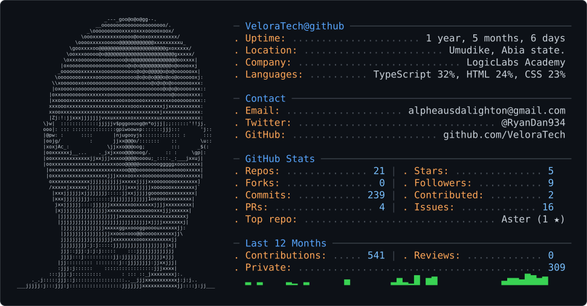

<picture>
  <source media="(prefers-color-scheme: dark)" srcset="dark_mode.svg" />
  <source media="(prefers-color-scheme: light)" srcset="light_mode.svg" />
  
</picture>Hey, I'm CoachLogic

Software Developer · Computer Engineering Student · Builder

«I build products. I explore systems. I learn by taking things apart.»

""GitHub" (https://img.shields.io/badge/GitHub-VeloraTech-181717?style=flat-square&logo=github)" (https://github.com/VeloraTech)
""LinkedIn" (https://img.shields.io/badge/LinkedIn-Profile-0A66C2?style=flat-square&logo=linkedin)" (https://www.linkedin.com/in/alpheaus-daniel-804600366)
""Email" (https://img.shields.io/badge/Email-Contact-EA4335?style=flat-square&logo=gmail)" (mailto:alpheausdalighton@gmail.com)

---

"$ whoami"

I'm a software developer and Computer Engineering student interested in building useful products and understanding the systems behind them.

I started with the web and have been gradually moving deeper into backend development, databases, APIs, infrastructure, and systems.

A question that keeps showing up in my work is:

«"How does this actually work underneath?"»

When I don't know, I build.

---

"$ currently_building"

CuraMed

Healthcare platform focused on clinical workflows, analysis, and intelligent assistance.

Stack: Python · FastAPI · PostgreSQL · React

Umudike Homes

Housing and accommodation platform focused on making local accommodation easier to discover and manage.

Stack: React · Node.js · Express · PostgreSQL

MyVendor

A hyper-local marketplace connecting people with nearby products, vendors, and service providers.

Developer Tooling

Exploring tools that automate repetitive developer workflows, including code cleanup and media-to-text workflows.

---

"$ philosophy"

build
  ↓
break
  ↓
learn
  ↓
rebuild

I don't believe every project needs to become a startup.

Sometimes I build something simply because I don't understand how it works yet.

«If I don't understand it, I'll probably try to build it.»

---

"$ stack"

Working with

HTML · CSS · JavaScript · React · Node.js · Express · PostgreSQL · Git

Currently learning

Python · FastAPI · React Native

Exploring

Docker · Supabase · developer tooling · systems

---

"$ connect"

Platform| Link
GitHub| "VeloraTech" (https://github.com/VeloraTech)
LinkedIn| "Alpheaus Daniel" (https://www.linkedin.com/in/alpheaus-daniel-804600366)
X| "Alpheaus Daniel" (https://x.com/RyanDan934)
Portfolio| Coming soon
Email| "Contact me" (mailto:alpheausdalighton@gmail.com)

---

## `$ status`

```text
┌──────────────────────────────────────────────┐
│                                              │
│  IDENTITY     : BUILDER                      │
│  FOCUS        : SOFTWARE + SYSTEMS          │
│  STATUS       : BUILDING                     │
│  DIRECTION    : GO DEEPER                    │
│                                              │
└──────────────────────────────────────────────┘
```

### Thanks for stopping by.

If something here catches your attention, explore the repositories.

**The projects are where the real story is.**


«Still learning. Still building. Still curious.»